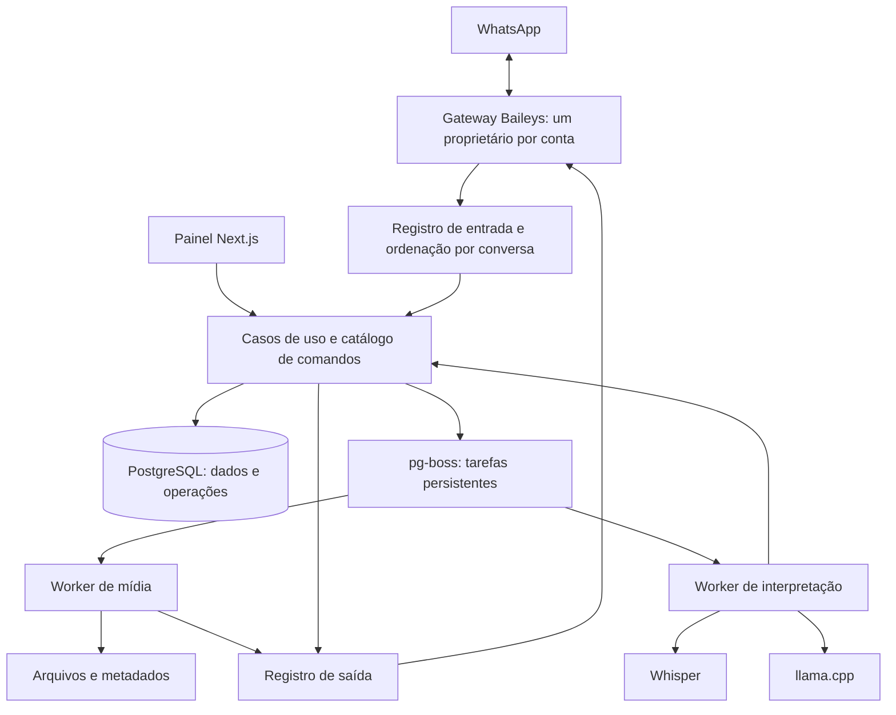

# Plano de evolução do Elisyum Bot

Proposta elaborada em 27/09/2026 a partir do código atual, incluindo o painel `web/`. Este documento registra o plano aprovado. O estado de implantação e as evidências estão em [implantacao-arquitetura-2026-09-27.md](implantacao-arquitetura-2026-09-27.md).

**Premissa de dimensionamento.** Uma instalação operada pelo proprietário, inicialmente em uma máquina, com uma conta WhatsApp, painel e inferência local. O desenho permite adicionar contas e workers depois. A escala desejada ainda pode ajustar a escolha do banco. A operação local continua disponível por um executor em terminal, sem depender de instalação de serviços de sistema.

**Decisão principal.** Evoluir para um monólito modular em TypeScript/Bun, com PostgreSQL, Drizzle e pg-boss. Separar o processo que mantém a conexão WhatsApp dos processos que executam mídia e inferência. Manter Next.js para o painel. Cada módulo terá contratos explícitos e testes; processos separados serão usados onde há trabalho pesado ou propriedade exclusiva da conexão.

**Por que considerar a troca do banco.** Hoje o bot usa `bun:sqlite`, o painel acessa o mesmo arquivo com libSQL/Drizzle e ambos conhecem o esquema. O painel também chama FFmpeg e ffprobe de forma síncrona dentro de uma requisição. A proposta organiza dados e trabalhos pendentes em uma mesma base transacional e permite executar workers separadamente. Não foi demonstrado que o SQLite atual esteja saturado: ele continua viável para uma instalação pequena. A sua limitação documentada de um escritor por arquivo importa à medida que aumentam processos e escrita. PostgreSQL exige administração, backup e restauração próprios. [Orientação oficial do SQLite](https://www.sqlite.org/whentouse.html).

**Tecnologias e escolhas.**

| Área | Escolha proposta | Motivo e condição |
|---|---|---|
| Linguagem e runtime | Manter TypeScript/ESM e Bun, com versão exata validada | O projeto já usa Bun e o pg-boss declara suporte. Trocar runtime junto com persistência aumentaria o escopo sem benefício demonstrado. |
| WhatsApp | Baileys `7.0.0-rc14`, versão fixada | É a versão mais recente verificada; o projeto usa rc13. Adotar após testes do adaptador. |
| Dados | PostgreSQL 18, em patch suportado fixado na implantação | Transações, integridade relacional e acesso por processos independentes. Usar migrações SQL revisáveis. |
| Acesso a dados | Drizzle + driver PostgreSQL compatível e testado com Bun | Reaproveita uma tecnologia do painel; esquema e migrações passam a ter uma única origem. |
| Trabalhos e agendamento | pg-boss com PostgreSQL | Persistência, tentativas controladas, agendamento e criação de jobs na transação da aplicação. Avaliar uma release fixada, sem depender de recursos existentes apenas no ramo principal. |
| Painel | Manter Next.js e a autenticação atual, revisando permissões | Rotas finas para consultar dados e solicitar operações. Conversões saem das requisições HTTP. |
| Mídia | FFmpeg/ffprobe e yt-dlp como subprocessos com argumentos separados | Limites, cancelamento e captura de erros em um único módulo; remover gradualmente `fluent-ffmpeg` e chamadas síncronas. |
| Voz | Manter faster-whisper em processo Python | A solução atual já funciona; melhorar admissão, fila, diagnósticos e avaliação antes de trocar o modelo. |
| Interpretação | Contrato `IntentParser`, com implementação local em llama.cpp | Regras precisas para pedidos simples; modelo para variações. OpenJev torna-se uma implementação substituível. |
| Arquivos | Disco local atrás de um contrato `BlobStore` | Usar chaves de arquivos, metadados e hashes; permite mudar o armazenamento sem alterar comandos. |
| Observabilidade | Logs JSON com identificador da operação e métricas por etapa | Identificar tempo de fila, transcrição, interpretação, download, envio e falha. |

A documentação do pg-boss informa suporte a Bun, PostgreSQL e jobs vinculados a transações, o que torna possível compartilhar a base operacional sem adicionar Redis nesta etapa. [pg-boss](https://github.com/timgit/pg-boss). Drizzle oferece transações e savepoints. [Drizzle](https://orm.drizzle.team/docs/transactions). PostgreSQL 18 é uma linha suportada; o patch deve ser conferido e fixado na implementação. [Política de versões](https://www.postgresql.org/support/versioning/).

O `fluent-ffmpeg` está descontinuado e o repositório foi arquivado. O bot já tem parte do trabalho implementada com subprocessos e workers, que pode ser consolidada. [Repositório oficial](https://github.com/fluent-ffmpeg/node-fluent-ffmpeg).

**Desenho dos processos.**

O diagrama representa responsabilidades. O registro de entrada, o registro de saída e a fila usam o mesmo PostgreSQL. O painel compartilha contratos e casos de uso com o bot; não recebe acesso às chaves da sessão WhatsApp. Workers produzem resultados, enquanto o gateway proprietário da conta realiza os envios.

**Contratos centrais.**

- `MessageEnvelope`: conta, conversa, chave original, identidade do remetente, tipo, referência à mídia, citação e horário. Os tipos do Baileys ficam no adaptador.
- `CommandDefinition`: nome, aliases, argumentos, contextos permitidos, permissões, confirmação, descrição, exemplos e executor. É a origem dos menus, validação e opções de interpretação.
- `CommandRequest`: operação identificada, ator, comando, argumentos validados, alvo e mídia resolvidos. Texto, voz, correção de digitação e painel convergem aqui.
- `CommandResult`: sucesso, rejeição, necessidade de esclarecimento, falha transitória ou resultado externo incerto. Erros deixam de ser tratados como uma única categoria.
- `IdentityResolver`, `WhatsAppGateway`, `MediaProcessor`, `IntentParser` e `BlobStore`: interfaces pequenas para substituir tecnologia e testar sem WhatsApp real.

**Execução e recuperação.**

1. Registrar uma mensagem elegível com uma chave única que inclua conta, conversa e os campos necessários da chave WhatsApp. Duplicatas não geram outra operação. Separar mensagens novas de histórico e aplicar prazo de validade ao trabalho recebido após reconexão.
2. Aplicar limites de admissão antes de baixar áudio ou chamar modelos. Ordenar as decisões que alteram estado dentro da conversa; permitir trabalho de mídia paralelo dentro dos limites de CPU, memória e disco.
3. Interpretar e validar a solicitação. O modelo não escolhe permissões, não produz JIDs executáveis por conta própria e não decide se uma confirmação pode ser dispensada.
4. Guardar confirmações com ator, conversa, argumentos, alvo, mídia, expiração e identificação da operação. Revalidar autorização ao receber “bot confirmar”. “Bot cancelar” encerra a solicitação sem executar o efeito.
5. Registrar a mudança de estado e o próximo trabalho na mesma transação quando aplicável. Não manter transações abertas durante downloads, inferência ou chamadas WhatsApp.
6. Guardar estado e tentativas da saída. Em uma queda entre o envio ao WhatsApp e a gravação do resultado, classificar como incerto e aplicar uma política por comando. Uma fila transacional não garante que um efeito externo aconteça exatamente uma vez. Operações sensíveis não devem ser repetidas cegamente.

Jobs terão prazo, quantidade máxima de tentativas, atraso progressivo, cancelamento e estado terminal inspecionável. Um processo encerrado não deverá perder trabalhos já aceitos. O agendamento persistente substitui a criação de cron jobs em cada reconexão.

**Identidades, dados e autenticação.**

| Conjunto | Responsabilidade |
|---|---|
| `bot_accounts` | Conta conectada, estado operacional e propriedade exclusiva da conexão. |
| `identities` e `identity_aliases` | Identidade interna estável, LID, número quando conhecido e origem do mapeamento. |
| `groups`, `memberships`, `role_grants` | Participação e autorização por conta e grupo. Usuário web e identidade WhatsApp são sujeitos distintos, associados apenas explicitamente. |
| `command_operations`, `confirmations` | Ciclo da solicitação, argumentos validados, autor e decisão. |
| `inbox`, `outbox` | Entrada deduplicada, saída e recuperação após falha. |
| `media_assets` | Chave de arquivo, hash, tamanho, duração, formato real, proprietário e retenção. |
| `audit_events` | Histórico de mudanças e resultados, com dados mínimos necessários. |
| Esquema privado de autenticação | Credenciais e chaves do Baileys, isoladas por conta, com permissões de banco restritas ao gateway. |

As chaves de autenticação são persistidas com transações e serialização compatível com `BufferJSON`, preservando todas as categorias usadas pelo Baileys. Escritas de credenciais precisam ser aguardadas e não entram na fila comum de jobs. Um bloqueio de propriedade por conta, acompanhado de identificação da geração da conexão, impede dois gateways de operar a mesma sessão; perder a propriedade encerra o socket e impede novos envios.

A política antifake também precisa mudar: um LID desconhecido não pode ser interpretado como telefone de país não permitido. Sincronizar metadados ao iniciar e aplicar moderação serão operações separadas, com estado e motivos registrados.

**Adequação ao Baileys atual.** A release rc14 é a mais recente confirmada no GitHub e no registro npm em 27/09/2026. A migração deve manter ESM, suportar LIDs e identificadores alternativos, testar `lid-mapping`, `device-list` e `tctoken`, usar a versão WhatsApp incluída na release e implementar os callbacks `cachedGroupMetadata` e `getMessage` com armazenamento apropriado. Reconexão não deve apagar credenciais por um erro genérico; redefinição de sessão será um fluxo explícito e distinto. [Release rc14](https://github.com/WhiskeySockets/Baileys/releases/tag/v7.0.0-rc14), [configuração](https://github.com/WhiskeySockets/baileys.wiki-site/blob/main/docs/socket/configuration.md), [migração para v7](https://github.com/WhiskeySockets/baileys.wiki-site/blob/main/docs/migration/to-v7.0.0.md).

**Simplificação da inferência.** O OpenJev atual encaminha a classificação para llama.cpp e transforma probabilidades de tokens em uma distribuição entre comandos. Proponho comparar essa implementação com um cliente direto que peça comando e argumentos em JSON restrito por esquema. O llama.cpp documenta esse recurso, mas sua aplicação será testada na versão fixada, e toda resposta será validada novamente pela aplicação. JSON válido não comprova intenção correta. [Servidor llama.cpp](https://github.com/ggml-org/llama.cpp/blob/master/tools/server/README.md).

A remoção do OpenJev depende de equivalência ou melhoria no corpus separado de avaliação, cobrindo comando, argumentos, alvo, mídia, negação e rejeição de pedidos ambíguos. Os controles de fila, timeout e limites que hoje passam pelo OpenJev precisam permanecer no novo caminho. A probabilidade de um token não será apresentada como probabilidade de acerto da intenção.

A palavra “bot” continua obrigatória para linguagem natural, preservando comandos com prefixo. Em áudio, sua presença só é conhecida depois da transcrição no desenho atual. Priorizar limites antes da transcrição e reutilização de resultados; avaliar um detector acústico separado apenas se as medições justificarem seu custo e não aumentarem rejeições de fala válida.

**Plano de migração com critérios de saída.**

| Etapa | Entrega | Critério de saída |
|---|---|---|
| 1. Estabelecer referência | Consolidar testes atuais, fixtures, instalação reproduzível e tempos por etapa | 34 comandos cobertos, testes de voz atuais passando e restauração do banco testada em cópia. Registrar comportamento e latência antes de mudar. |
| 2. Extrair contratos | Catálogo único, executor comum, identidade e gateway atrás de interfaces; corrigir ciclo de conexão | Todas as entradas respeitam bloqueios e permissões; reconectar repetidamente não duplica scheduler; duplicatas e mensagens durante inicialização têm tratamento definido. |
| 3. Atualizar transporte | Baileys rc14 em alteração própria, com caches, autenticação e normalização cobertos | Reinício preserva sessão; mídia, citação, grupos e identificação LID/PN passam nos testes. Validar no Grupo de teste. |
| 4. Introduzir PostgreSQL | Esquema compartilhado, Drizzle, importador SQLite e adaptadores de repositório | Comparação de contagens, invariantes e conteúdo importado; painel e bot usam a mesma versão do esquema; round-trip das chaves preservado. |
| 5. Persistir operações | pg-boss, inbox/outbox, confirmações, agendamento e recuperação | Encerrar worker em diferentes etapas não perde jobs aceitos; repetição não duplica alterações locais; efeitos externos incertos ficam identificados. |
| 6. Separar mídia e painel | Workers, progresso de jobs, arquivos por chave e eliminação de operações síncronas nas rotas | Upload recebe identificação da tarefa; painel segue responsivo durante conversões; concorrência tem limites e arquivos são limpos após falha. |
| 7. Avaliar inferência simplificada | Implementação direta de `IntentParser` comparada ao OpenJev | Aprovação em corpus não usado para ajustar prompts, incluindo ambiguidades e voz; sem regressão em autorização e confirmação; medir latência e uso de recursos. |
| 8. Consolidar operação | Logs, métricas, retenção, backup, atualização e instruções de execução | Recuperação em ambiente limpo, versões e pesos identificados, operação contínua observada e falhas principais reproduzidas. |

Cada etapa produz uma alteração revisável e executável. A mudança de banco fica separada da troca de versão Baileys e da mudança de inferência para facilitar diagnóstico e retorno.

**Corte do SQLite para PostgreSQL.** Fazer primeiro importações ensaiadas em cópia. No corte real, interromper os escritores do painel e do bot, aguardar persistência da autenticação, produzir snapshot consistente e importar. Verificar relações, totais, arquivos e serialização das chaves antes de abrir um único gateway com a nova base. Evitar duas instâncias conectadas à mesma conta. O SQLite original permanece como snapshot, não como segundo destino ativo de escrita.

O retorno ao snapshot só é direto antes de novas escritas. Depois que PostgreSQL passa a receber dados e atualizações das chaves de sessão, retornar exige exportação/reconciliação do estado atual ou correção progressiva. Não restaurar credenciais antigas como procedimento rotineiro de rollback.

**Testes que passam a fazer parte da entrega.** Reexecução da mesma mensagem; mensagem recebida durante inicialização; promoção/rebaixamento e perda de permissão antes da confirmação; participante conhecido apenas por LID; confirmação vencida; queda depois de enviar e antes de registrar; Whisper indisponível; modelo lento; fila cheia; disco cheio; conversão inválida; upload e exclusão concorrentes; reconexões repetidas e restauração de backup. Operações de administração e anúncios globais continuam cobertas em ambiente isolado; as validações reais ficam no grupo autorizado.

**Alternativas e gatilhos.**

| Alternativa | Quando faria sentido |
|---|---|
| Continuar com SQLite | Se o objetivo permanecer uma única instalação pequena e a operação de PostgreSQL não compensar. Contratos, executor único, identidade e ciclo de conexão ainda devem ser implementados; a fila precisará de uma solução persistente compatível. |
| Redis + BullMQ | Se medições mostrarem que filas precisam de capacidade ou isolamento próprios. Acrescenta um armazenamento e uma fronteira transacional que o desenho inicial evita. |
| Node.js LTS | Se houver uma incompatibilidade reproduzível com Bun ou exigência de implantação. A migração precisa cobrir SQLite nativo legado, workers, testes, launcher e uso de Bun pelo yt-dlp. |
| Armazenamento de objetos | Quando workers e painel deixarem de compartilhar a mesma máquina ou o volume de mídia exigir outra política de armazenamento. |
| Outro modelo de linguagem/voz | Quando superar a referência em dados representativos, com orçamento de CPU/memória e latência medidos. |

O escopo foi ajustado aos 34 comandos preservados na revisão do catálogo. A sequência acima orienta a implantação e os critérios de verificação.
